# Differential Fuzzing on ⚡

<!--
Hello, my name is Erick Cestari. 

I will talk about differential fuzzing on the Lightning Network. A technique to find bugs between different Lightning implementations.
-->

---

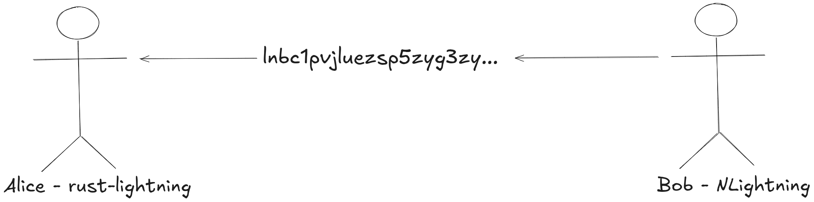

<!--
So imagine this scenario: Bob is trying to sell coffee to Alice. 
Bob is using NLightning to generate the invoice, and Alice is using Rust-Lightning to make the payment.
Bob generates and sends the invoice to Alice.
-->

---

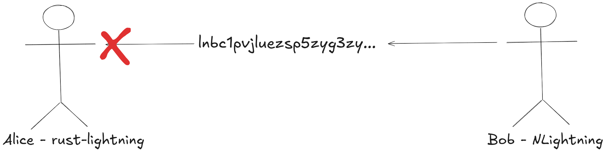

<!--
Alice tries to pay the invoice using Rust-Lightning, but it fails to decode the invoice. 
She gets an error and can't complete the payment.
-->

---

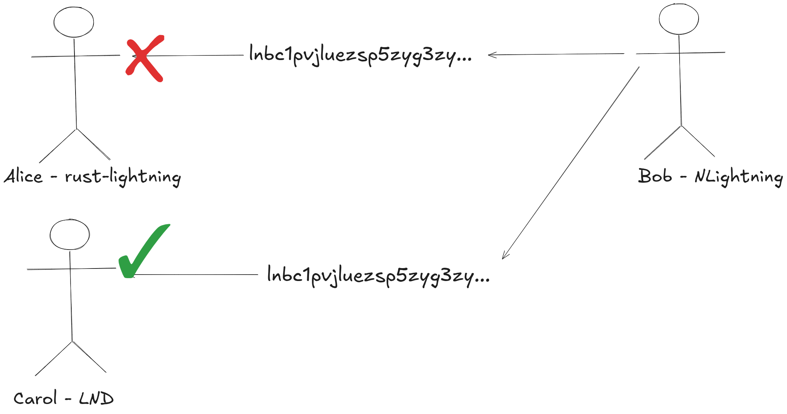

<!--
Frustrated, Alice asks her friend Carol for help. 
Carol tries to pay the same invoice using her LND node, and this time it succeeds! 
Same invoice, different implementation, different result.
-->

---

## Implementation Differences

Different Lightning implementations can interpret the same data differently

Real-world impact:

* **Network instability** -  Interoperability failures between implementations
* **Poor user experience** - Success depends on implementation choice

Traditional approach:

* Wait for users to report bugs
* Manual testing between implementations
* Reactive fixes

<!--
Different Lightning implementations can interpret the same data differently. Real-world impact: Poor user experience where success depends on which implementation you're using. Traditional approach: Wait for users to report bugs, manual testing between implementations, reactive fixes.
-->
---
class: flex items-center justify-center text-center
---

# How do we systematically find these discrepancies before they cause problems?

<!--
How do we systematically find these discrepancies before they cause problems?
-->

---
class: flex items-center justify-center text-center
---

# Solution: Differential Fuzzing

<!--
So the solution is by doing differential fuzzing. The theme of this presentation :)
-->

---

# Who am I?

* Erick Cestari
* Vinteum Grantee (Bitcoin development funding)
* Maintainer of bitcoinfuzz. Found 15+ bugs across Lightning implementations (we'll see some of them)

<!--
But first, Who am I?

My name is Erick Cestari.

I am a Vinteum grantee. That's Bitcoin development funding for those who aren't familiar.

I'm the maintainer of bitcoinfuzz, where I've found over 15 bugs across various Lightning implementations and reported some security disclosures.
-->
---
---
## Bitcoin: Code as Specification
If we built a new Bitcoin implementation today, where would we find the specification?

* Bitcoin Core codebase. The reference implementation
* No formal written specification document
* Consensus rules are implicit in the code
<!--
Bitcoin has an interesting characteristic. There's no formal specification document. 
If you want to build a new Bitcoin implementation today, you essentially have to reverse-engineer Bitcoin Core.
The consensus rules are implicit in the code, which means implementation differences can be catastrophic.
-->
---

## Lightning: Specification-First Approach

Lightning Network took a different approach with BOLT specifications

* BOLT = Basis of Lightning Technology
* Formal written specifications for all protocol aspects
* Multiple implementations can follow the same spec
* But... specifications can be ambiguous or incomplete

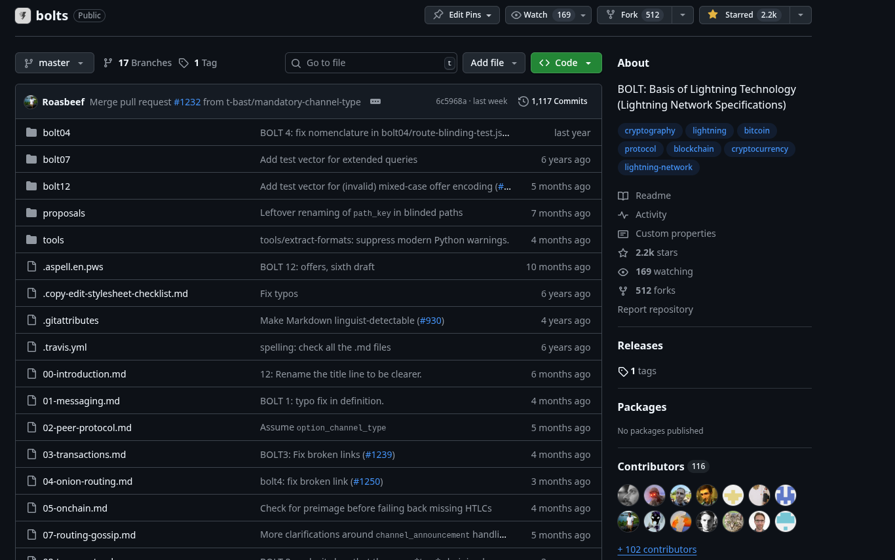

<!--
Lightning Network learned from Bitcoin's approach and took a specification-first approach.
BOLT stands for Basis of Lightning Technology. These are formal written specifications that cover all aspects of the Lightning protocol.
This allows multiple implementations to follow the same spec and theoretically be compatible.

But here's the catch. Specifications can be ambiguous or incomplete. 
Even with a formal spec, different teams can interpret the same requirements differently.
This is where our differential fuzzing comes in. To find these interpretation differences systematically.
-->

---
---
## Edge Cases
BOLT specifications are comprehensive, but they can't cover every edge case.
When the spec says `r field should contain one or more entries`.
What happens with zero entries? The spec doesn't explicitly say.

This is where implementations diverge:
- Some reject it (Rust-Lightning, Core Lightning)  
- Others accept it (LND, Eclair)

Differential fuzzing systematically explores these specification gaps.

<!--
So here's the core challenge with specifications. Even when they're comprehensive like BOLT, they can't anticipate every possible edge case.

Take this real example from our fuzzing results: The BOLT11 specification says the 'r' field should contain "one or more entries" for routing information. Sounds clear, right?

But what happens when you encounter an 'r' field that exists but contains zero entries? The specification doesn't explicitly address this scenario.

And this is exactly where we see implementations diverge. Rust-Lightning and Core Lightning take a strict interpretation. They reject invoices with empty 'r' fields. Meanwhile, LND and Eclair are more permissive. They accept these invoices.

Neither approach is necessarily wrong. They're just different interpretations of an ambiguous specification.

This is the perfect example of why differential fuzzing is so valuable. Instead of waiting for users to discover these incompatibilities in production, we can systematically generate edge cases like this and find where implementations behave differently. This helps us identify specification gaps before they cause real-world payment failures.
-->
---

# So let's start simple, what is fuzzing?

- Fuzzing is an automated software testing technique that involves providing invalid, unexpected, or random data as inputs to a computer program.

<!--
So let's start by fuzzing testing technique. So it's an automated software testing technique that involves providing invalid, unexpected or random data as inputs to a program.
-->

---
class: flex items-center justify-center text-center
---

<div style="transform: scale(3.2);">

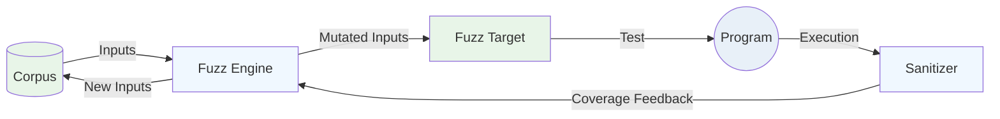
</div>

<!--
This diagram illustrates the basic workflow of fuzzing. The corpus contains the initial set of inputs, which are mutated by the fuzzing engine. These mutated inputs are passed to the fuzz target. The specific part of the program being tested. When executed, the program runs with sanitizers that monitor for issues like crashes or memory errors. The sanitizers then provide coverage feedback to the fuzzer engine, which uses this information to decide whether to keep the new input in the corpus for further mutation.
-->
---
---
## Coverage-Sanitizer

We use coverage-sanitizer to track which code paths are exercised.

It inserts calls to user-defined functions on function-, basic-block-, and edge- levels.

```c
#include <stdio.h>
#include <stdlib.h>

int calculate_grade(int score) {
    if (score >= 90) {
        return 'A';
    } else if (score >= 80) {
        return 'B';
    } else if (score >= 70) {
        return 'C';
    } else if (score >= 60) {
        return 'D';
    } else {
        return 'F';
    }
}
```
<!--
Coverage sanitizers provide feedback to the fuzzer by tracking which parts of the code are executed. During compilation, they insert instrumentation calls at various code levels (e.g., functions, basic blocks, edges) to report execution paths. The fuzzer uses this feedback to decide whether a given input explores new behavior and should be retained in the corpus. Below is a simple example function that calculates a grade from a score. We'll use this to compare builds with and without coverage sanitization.
-->
---
---
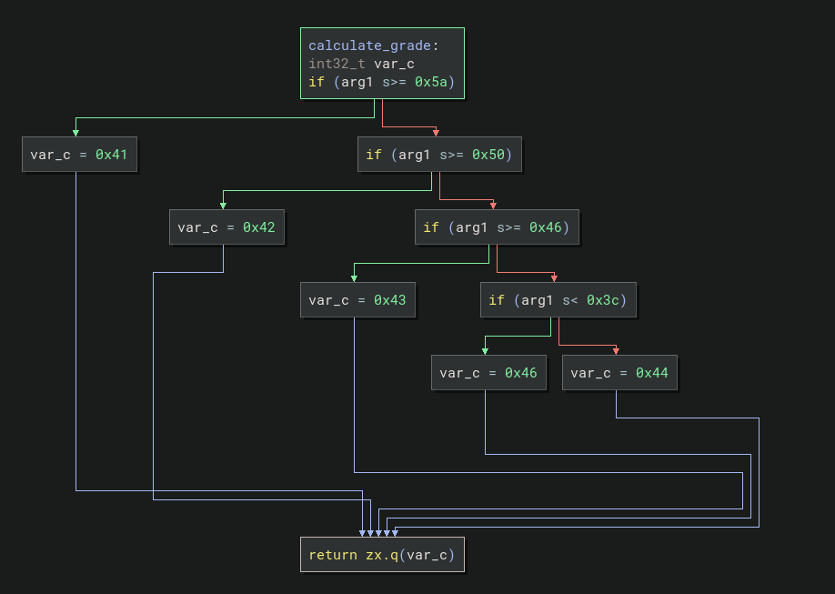
<!--
This a High Level view of the C code compiled to machine code without Coverage Sanitizers.
-->
---
---
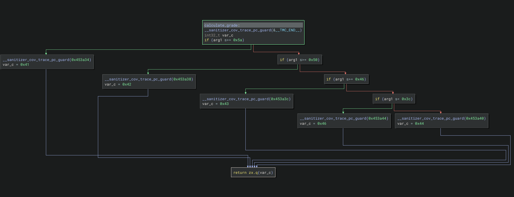
<!--
This a High Level view of the C code compiled to machine code with Coverage Sanitizers. We can see that it adds function calls to send coverage information to the fuzzer.
-->
---

# Let's see an example in practice

What is the problem with this double function?
```rust
use libfuzzer_sys::fuzz_target;

fn double(x: i32) -> i32 {
    x * 2
}

fuzz_target!(|data: &[u8]| {
    if let Some(x) = consume_i32(data) {
        let _ = double(x);
    }
});
```

<!--
This is an example of a bug that fuzzing can find. We have this double function that receives a signed integer 32 bits that then will be multiplied by 2. In this example we can see that the double function doesn't handle overflow, so running the fuzzer we will see that it will crash by overflow.
-->

---
---
# Let's try now with double function fixed

```rust
use libfuzzer_sys::fuzz_target;

fn double(x: i32) -> Option<i32> {
    x.checked_mul(2)
}

fuzz_target!(|data: &[u8]| {
    if let Some(x) = consume_i32(data) {
        let _ = double(x);
    }
});
```

<!--
Now let's try with the function fixed to see what happens. We can see that the fuzzer get stuck because it explored all the code and maximized the coverage and didn't find any crashes.
-->

---
---

# Differential Fuzzing

- Generate inputs and feed them simultaneously to **multiple programs**.
- Compare the outputs of the programs to find discrepancies.

<!--
Differential fuzzing will feed two or more programs with the same input and compare those outputs. If they are different outputs the program will crash and save the possible bug.
-->

---
class: flex items-center justify-center text-center
---

<div style="transform: scale(3.2);">

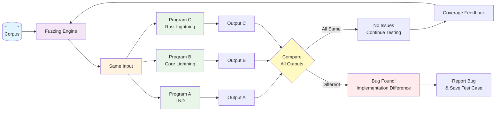
</div>

<!--
This is an overview diagram of differential fuzzing. The outputs can be structured in many different ways. So it could be a boolean type, integer, string, structured formats, etc. It’s important to return the max information possible in the outputs to then be able to catch most/all the discrepancies.
-->
---
---
# Example: Differential Fuzzing

```rust
fn double(x: i32) -> Option<i32> {
    x.checked_mul(2)
}

fn double2(x: i32) -> Option<i32> {
    // Off-by-one: using >= instead of >
    if x >= i32::MAX / 2 || x <= i32::MIN / 2 {
        None
    } else {
        Some(x * 2)
    }
}

fuzz_target!(|data: &[u8]| {
    if let Some(x) = consume_i32(data) {
        let res = double(x);
        let res2 = double2(x);
        if res != res2 {panic!("x: {}, res: {:?}, res2: {:?}", x, res, res2);}
    }
});
```
---
---

## Bitcoinfuzz: Bitcoin Differential Fuzzing

**What we're building:**
* Differential Fuzzing framework for Bitcoin protocol implementations and libraries
* Focus: Find discrepancies before they cause issues

**Current targets (for lightning network):**

* modules: LND, Core Lightning, Rust-Lightning, Eclair, lightning-kmp
* targets: deserialize_invoice, deserialize_offer

**Status:** 30 bugs found so far.
---
---
## How Bitcoinfuzz can work with different languages?

- Compile with instrumentation (if possible)

LND:
```bash
go build -o liblnd_wrapper.a -buildmode=c-archive -tags=libfuzzer -gcflags=all=-d=libfuzzer wrapper.go
```

rust-lightning:
```bash
RUSTFLAGS="-Z sanitizer=address" cargo rustc --release -- -C passes='sancov-module' \
    -C llvm-args=-sanitizer-coverage-inline-8bit-counters \
    -C llvm-args=-sanitizer-coverage-trace-compares \
    -C llvm-args=-sanitizer-coverage-pc-table \
    -C llvm-args=-sanitizer-coverage-level=4 \
    -C llvm-args=-simplifycfg-branch-fold-threshold=0
```
---
---
## But for languages that can't be compiled to machine code?

- Use ffi (foreign function interface)
- For java, use JNI

Eclair:
```cpp
static std::optional<std::string> eclair_decode_invoice(const char* invoiceStr) {
    if (!init_jvm() || !jvm) {
        std::abort();
    }

    JNIEnv* env = nullptr;
    jint status = jvm->GetEnv((void**)&env, JNI_VERSION_1_8);

    jstring jInvoiceStr = env->NewStringUTF(invoiceStr);
    if (!jInvoiceStr) {
        return "";
    }

    jstring jResult = static_cast<jstring>(
        env->CallStaticObjectMethod(decoderClass, decodeMethod, jInvoiceStr)
    );
    env->DeleteLocalRef(jInvoiceStr);
```
---
---
## Let's breakdown a target in Bitcoinfuzz

- We need to define at least three things to create a target:

1. Input type
2. Output type
3. Target function
4. Custom mutators (if needed)

---
---
# Example: deserialize_invoice target

1. Input type: BOLT11 invoice string
2. Output type: string containing all the invoice data (e.g., amount, description, etc.)
3. Target function: deserialize_invoice
4. Custom mutators: Bech32 custom mutator
---
---
## rust-lightning:
```rust
#[no_mangle]
pub unsafe extern "C" fn ldk_des_invoice(input: *const std::os::raw::c_char) -> *mut c_char {
    if input.is_null() {
        return str_to_c_string("");
    }

    // Convert C string to Rust string
    let c_str = match CStr::from_ptr(input).to_str() {
        Ok(s) => s,
        Err(_) => return str_to_c_string(""),
    };

    match Bolt11Invoice::from_str(c_str) { // <-- target function
        Ok(invoice) => {
            if invoice.currency() != Currency::Bitcoin {
                return str_to_c_string("");
            }
            let mut result = String::new(); // <-- output

            result.push_str("HASH=");
            result.push_str(&invoice.payment_hash().to_string());

            result.push_str(";PAYMENT_SECRET=");
            result.push_str(&invoice.payment_secret().to_string());
            ...
```
---
---
## LND:

```go
//export LndDeserializeInvoice
func LndDeserializeInvoice(cInvoiceStr *C.char) *C.char {
	if cInvoiceStr == nil {
		return C.CString("")
	}

	runtime.GC()

	// Convert C string to Go string
	invoiceStr := C.GoString(cInvoiceStr)

	network := &chaincfg.MainNetParams

	invoice, err := zpay32.Decode(invoiceStr, network) // <-- target function
	if err != nil {
		return C.CString("")
	}

	var sb strings.Builder // <-- output

	sb.WriteString("HASH=")
	if invoice.PaymentHash != nil {
		sb.WriteString(fmt.Sprintf("%x", *invoice.PaymentHash))
	}
    ...
```
---
---
## Custom mutator

```cpp
size_t LLVMFuzzerCustomMutator(uint8_t *fuzz_data, size_t size, size_t max_size,
                               unsigned int seed)
{
    // A minimum size of 9 prevents hrp_maxlen <= 0 and data_maxlen <= 0.
    if (size < 9)
        return initial_input(fuzz_data, max_size);

    // Interpret fuzz input as string
    std::string input(reinterpret_cast<char*>(fuzz_data), size);

    size_t data_maxlen = input.size() - 8;
    size_t hrp_maxlen = input.size() - 6;

    // Attempt to bech32 decode the input
    bech32::DecodeResult decoded = bech32::Decode(input, bech32::CharLimit::CUSTOM_MUTATOR);
    if (decoded.encoding != bech32::Encoding::BECH32) {
        return initial_input(fuzz_data, max_size);
    }

    auto data = decoded.data;
    auto hrp = decoded.hrp;
    ...
```
---
---
## Compare the outputs

```cpp
void Driver::InvoiceDeserializationTarget(std::span<const uint8_t> buffer) const
    {
        FuzzedDataProvider provider(buffer.data(), buffer.size());
        std::string invoice{provider.ConsumeRemainingBytesAsString()};
        std::optional<std::string> last_response{std::nullopt};
        std::string last_module_name;

        for (auto &module : modules)
        {
            std::optional<std::string> res{module.second->deserialize_invoice(invoice)};
            if (!res.has_value()) continue;
            if (last_response.has_value()) {
                if (*res != *last_response) {
                    std::cout << "Invoice deserialization failed for " << invoice << std::endl;
                    std::cout << "Module: " << module.first << std::endl;
                    std::cout << "Result: " << *res << std::endl;
                    std::cout << "Module: " << last_module_name << std::endl;
                    std::cout << "Result: " << *last_response << std::endl;
                }
                assert(*res == *last_response);
            }

            last_response = res.value();
            last_module_name = module.first;
        }
    }
```
---
---
## So which bugs we have found so far?

Lightning-kmp incorrectly rejected valid invoices because it verified recovered public keys against non-normalized signatures.
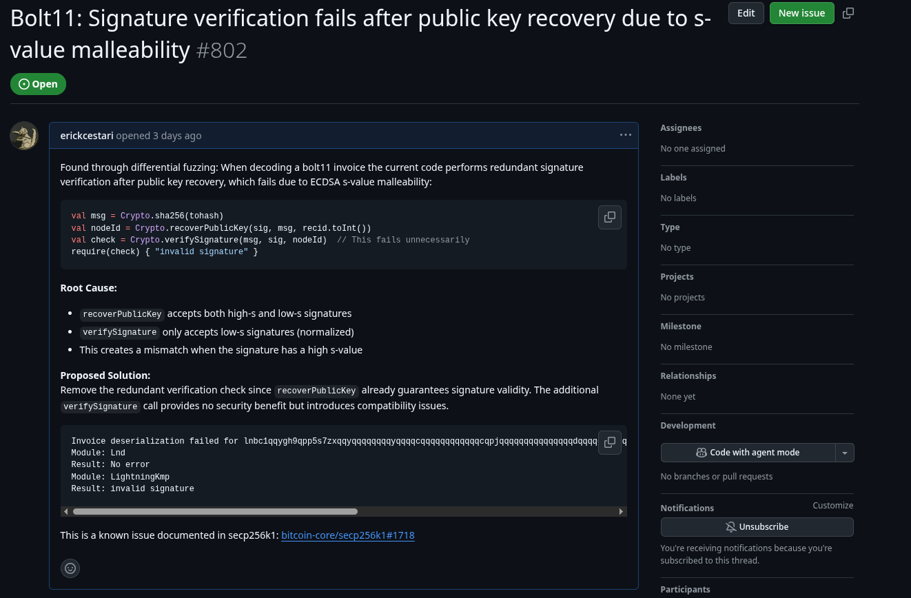

<!--
TODO: Display with more details the bugs we found
-->
---
---
## C-Lightning accepting invalid invoices

C-Lightning was accepting invoices with routing hints without validating the public key format.

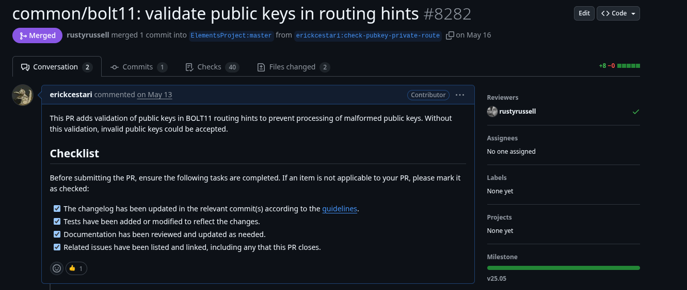

---
---
## Doing differential fuzzing of projects that do not have fuzz testing

Some projects do not have support for fuzzing or do not run their fuzz targets continuously. It means that we could find bugs not because of the
"differential" thing, but simply because the project has not been fuzzed. 

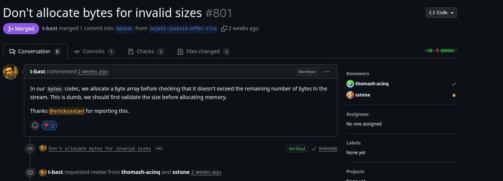
---
class: flex flex-col items-center text-center h-full
---

<div class="flex-1 flex items-center justify-center">

# Thank You!

</div>

<div>
erickcestari03@gmail.com
</div>
<div>
github.com/erickcestari
</div>