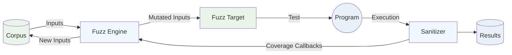

# Differential Fuzzing on ⚡

<!--
Hello, my name is Erick Cestari. 

I will talk about differential fuzzing on the Lightning Network. A technique to find bugs between different Lightning implementations.
-->

---


<!--
So imagine this scenario: Bob is trying to sell coffee to Alice. 
Bob is using NLightning to generate the invoice, and Alice is using Rust-Lightning to make the payment.
Bob generates and sends the invoice to Alice.
-->

---


<!--
Alice tries to pay the invoice using Rust-Lightning, but it fails to decode the invoice. 
She gets an error and can't complete the payment.
-->

---


<!--
Frustrated, Alice asks her friend Carol for help. 
Carol tries to pay the same invoice using her LND node, and this time it succeeds! 
Same invoice, different implementation, different result.
-->

---

## Implementation Differences

Different Lightning implementations can interpret the same data differently

Real-world impact:

* Poor user experience

Traditional approach:

* Wait for users to report bugs
* Manual testing between implementations
* Reactive fixes

<!--
Different Lightning implementations can interpret the same data differently. Real-world impact: Poor user experience where success depends on which implementation you're using. Traditional approach: Wait for users to report bugs, manual testing between implementations, reactive fixes.
-->
---
class: flex items-center justify-center text-center
---

# How do we systematically find these discrepancies before they cause problems?

<!--
How do we systematically find these discrepancies before they cause problems?
-->

---
class: flex items-center justify-center text-center
---

# Solution: Differential Fuzzing

<!--
So the solution is by doing differential fuzzing. The theme of this presentation :)
-->

---

# Who am I?

* Erick Cestari
* Vinteum Grantee (Bitcoin development funding)
* Maintainer of bitcoinfuzz. Found 15+ bugs across Lightning implementations (we'll see some of them)
* **Why this matters:** I've seen firsthand how implementation differences create real problems

<!--
But first, Who am I?

My name is Erick Cestari.

I am a Vinteum grantee. That's Bitcoin development funding for those who aren't familiar.

I'm the maintainer of bitcoinfuzz, where I've found over 15 bugs across various Lightning implementations and reported some security disclosures.

Why does this matter for today's talk? I've seen firsthand how these implementation differences create real problems for users and the network. That's what motivated me to develop systematic approaches to find these issues before they impact real users.
-->
---
---
## Bitcoin: Code as Specification
If we built a new Bitcoin implementation today, where would we find the specification?

* Bitcoin Core codebase. The reference implementation
* No formal written specification document
* Consensus rules are implicit in the code
<!--
Bitcoin has an interesting characteristic. There's no formal specification document. 
If you want to build a new Bitcoin implementation today, you essentially have to reverse-engineer Bitcoin Core.
The consensus rules are implicit in the code, which means implementation differences can be catastrophic.
-->
---

## Lightning: Specification-First Approach

Lightning Network took a different approach with BOLT specifications

* BOLT = Basis of Lightning Technology
* Formal written specifications for all protocol aspects
* Multiple implementations can follow the same spec
* But... specifications can be ambiguous or incomplete


<!--
Lightning Network learned from Bitcoin's approach and took a specification-first approach.
BOLT stands for Basis of Lightning Technology. These are formal written specifications that cover all aspects of the Lightning protocol.
This allows multiple implementations to follow the same spec and theoretically be compatible.

But here's the catch. Specifications can be ambiguous or incomplete. 
Even with a formal spec, different teams can interpret the same requirements differently.
This is where our differential fuzzing comes in. To find these interpretation differences systematically.
-->

---
---
## Edge Cases
BOLT specifications are comprehensive, but they can't cover every edge case.
When the spec says `r field should contain one or more entries` - 
what happens with zero entries? The spec doesn't explicitly say.

This is where implementations diverge:
- Some reject it (Rust-Lightning, Core Lightning)  
- Others accept it (LND, Eclair)

Differential fuzzing systematically explores these specification gaps.

<!--
So here's the core challenge with specifications. Even when they're comprehensive like BOLT, they can't anticipate every possible edge case.

Take this real example from our fuzzing results: The BOLT11 specification says the 'r' field should contain "one or more entries" for routing information. Sounds clear, right?

But what happens when you encounter an 'r' field that exists but contains zero entries? The specification doesn't explicitly address this scenario.

And this is exactly where we see implementations diverge. Rust-Lightning and Core Lightning take a strict interpretation. They reject invoices with empty 'r' fields. Meanwhile, LND and Eclair are more permissive. They accept these invoices.

Neither approach is necessarily wrong. They're just different interpretations of an ambiguous specification.

This is the perfect example of why differential fuzzing is so valuable. Instead of waiting for users to discover these incompatibilities in production, we can systematically generate edge cases like this and find where implementations behave differently. This helps us identify specification gaps before they cause real-world payment failures.
-->
---

# So let's start simple, what is fuzzing?

- Fuzzing is an automated software testing technique that involves providing invalid, unexpected, or random data as inputs to a computer program.

<!--
So let's start by fuzzing testing technique. So it's an automated software testing technique that involves providing invalid, unexpected or random data as inputs to a program.
-->

---
class: flex items-center justify-center text-center
---

<div style="transform: scale(3.2);">


</div>

<!--
So this diagram shows an overview of how fuzzing works. We can see the corpus which is the inputs that we use to feed to our program after being mutated by the Fuzzer Engine. The target is the function/part of code we want to test of the program. So when we execute a input it will trigger the sanitizers that then give the feedback to the fuzzer engine that will choose based on coverage to save or not that input to the corpus.
-->

---

What is the problem with this double function?

```rust
use libfuzzer_sys::fuzz_target;

fn double(x: i32) -> i32 {
    x * 2
}

fuzz_target!(|data: &[u8]| {
    if let Some(x) = consume_i32(data) {
        let _ = double(x);
    }
});
```

<!--
This is an example of a bug that fuzzing can find. We have this double function that receives a signed integer 32 bits that then will be multiplied by 2. In this example we can see that the double function doesn't handle overflow, so running the fuzzer we will see that it will crash by overflow.
-->

---

# Let's try now with double function fixed

```rust
use libfuzzer_sys::fuzz_target;

fn double(x: i32) -> Option<i32> {
    x.checked_mul(2)
}

fuzz_target!(|data: &[u8]| {
    if let Some(x) = consume_i32(data) {
        let _ = double(x);
    }
});
```

<!--
Now let's try with the function fixed to see what happens. We can see that the fuzzer get stuck because it explored all the code and maximized the coverage and didn't find any crashes.
-->

---

## Coverage-Guided Fuzzing

Smarter Fuzzing with Coverage
Instead of random inputs:

- Track which code paths are exercised
- Mutate inputs that discover new paths
- Focus on edge cases that trigger unusual behavior

Result: Find bugs faster with fewer test cases

<!--
C
-->

---
---
## Coverage-Sanitizer

We use coverage-sanitizer to track which code paths are exercised.

It inserts calls to user-defined functions on function-, basic-block-, and edge- levels.

```c
#include <stdio.h>
#include <stdlib.h>

int calculate_grade(int score) {
    if (score >= 90) {
        return 'A';
    } else if (score >= 80) {
        return 'B';
    } else if (score >= 70) {
        return 'C';
    } else if (score >= 60) {
        return 'D';
    } else {
        return 'F';
    }
}
```
---
---

---
---

---
---

# Differential Fuzzing

- Generate thousands of inputs and feed them simultaneously to **multiple implementations**.

```rust
use libfuzzer_sys::fuzz_target;

fn double(x: i32) -> Option<i32> {
    x.checked_mul(2)
}

fn double2(x: i32) -> Option<i32> {
    // Off-by-one: using >= instead of >
    if x >= i32::MAX / 2 || x <= i32::MIN / 2 {
        None
    } else {
        Some(x * 2)
    }
}

fuzz_target!(|data: &[u8]| {
    if let Some(x) = consume_i32(data) {
        let res = double(x);
        let res2 = double2(x);
        if res != res2 {panic!("x: {}, res: {:?}, res2: {:?}", x, res, res2);}
    }
});
```

---
---

<div style="height: 500px; overflow: hidden;">

<div style="transform: scale(0.7); transform-origin: top center; height: 125%;">


</div>
</div>

---
---

## Bitcoinfuzz: Bitcoin Differential Fuzzing

**What we're building:**
* Differential Fuzzing framework for Bitcoin protocol implementations and libraries
* Focus: Find discrepancies before they cause issues

**Current targets (for lightning network):**

* modules: LND, Core Lightning, Rust-Lightning
* targets: deserialize_invoice, deserialize_offer

**Status:** 30 bugs found so far.
---
class: flex flex-col items-center text-center h-full
---

<div class="flex-1 flex items-center justify-center">

# Thank You!

</div>

<div>
erickcestari03@gmail.com
</div>
<div>
github.com/erickcestari
</div>
